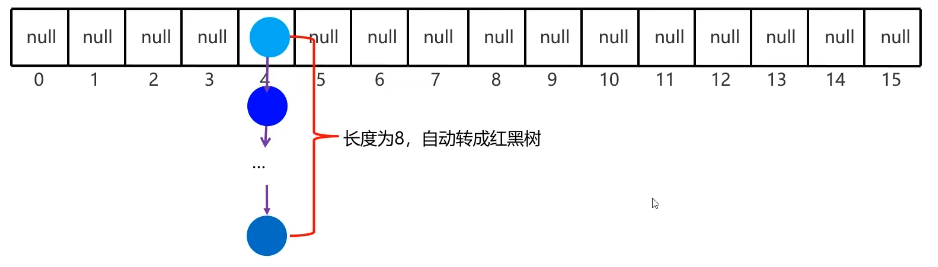

==Map集合体系==

[TOC]


# Map集合的概述

## Map集合概述和使用

- `Map`集合是一种双列集合，每个元素包含两个数据
- `Map`集合的每个元素的格式：`key = value`(键值对元素)
- `Map`集合也被称为**"键值对集合"**。

## Map集合整体格式

- `Collection`集合的格式：`[元素1, 元素2, 元素3...]`

- `Map`集合的完整格式：

  ```java
  {
      key1 = value1,
      key2 = value2,
      key3 = value3,
      ...
  }
  ```

## Map集合是什么，使用场景

- `Map`集合是键值对集合
- **`Map`集合非常适合做类购物车这样的业务场景**

# Map集合体系特点

## Map集合体系


​	**说明**

- **使用最多的Map集合是`HashMap`.**
- 重点掌握`HashMap`，`LinkedMap`，`TreeMap`。其他的后续理解。

## Map集合体系特点

- `Map`集合的特点是由建决定的
- `Map`集合的建是无序的，不重复的，无索引的，值无要求（可以重复）
- `Map`集合后面重复的键值对应的值回覆盖前面重复键的值
- `Map`集合的键值对都可以为`null`

## Map集合实现类特点

- **`HashMap`**：元素按照键是无序，不重复，无索引，值不做要求（与Map体系一致）
- **`LinkedHashMap`**:元素按照键是**有序**，不重复，无索引，值不做要求
- **`TreeMap`**:元素按照键是**排序**，不重复，无索引，值不做要求

# Map集合常用API

## Map集合

- Map是双列集合的祖宗接口，他的功能全部双列集合都可以继承使用的

## Map API

| 方法名称                              | 说明                                 |
| :------------------------------------ | :----------------------------------- |
| `V put(K key, V value)`               | 添加元素                             |
| `V remove(Objecgt key)`               | 根据键删除键值对元素                 |
| `void clear()`                        | 移除所有的键值对元素                 |
| `boolean containsKey(Object key)`     | 判断集合是否包含指定的键             |
| `boolean containsValue(Object value)` | 判断集合是否包含指定的值             |
| `boolean isEmpty()`                   | 判断集合是否为空                     |
| `int size()`                          | 集合的长度，也就是集合中键值对的个数 |
| `Set<K> keySet()`                     | 获取全部键的集合                     |
| `Collection<V> values()`              | 获取全部值的集合                     |
| `V1 pushAll(V2)`                      | 合并其他的的Map集合                  |
| V size()                              | 获取集合的大小                       |

## Map集合的变量方式一：键找值

- 先获取`Map`集合的全部键的`Set`集合

- 再遍历键的`Set`集合，然后通过键提取对应的值

- 键找值涉及**API**

  
  
  | 方法名称             | 说明             |
  | :------------------- | :--------------- |
  | `Set<K> keySet()`    | 获取所有键的集合 |
  | `V get(Objecgt key)` | 根据键获取值     |

## Map集合的变量方式二：键值对

- 先把Map集合转换成Set集合，Set类型中灭个元素都是键值对类型了。

- 遍历Set集合，然后提取键以及提取值。

  | 方法名称                         | 说明                     |
  | :------------------------------- | :----------------------- |
  | `Set<Map.Entry<K,V>> entrySet()` | 获取所有键值对对象的集合 |
  | `K getKey()`                     | 获取键                   |
  | `V getValue()`                   | 获取值                   |

## Map集合的变量方式三：Lambda

| 方法名称                                                     | 说明                  |
| :----------------------------------------------------------- | :-------------------- |
| `default void forEach(BiConsumer<? super K, ? super V> ation)` | 集合lambda遍历Map集合 |

- 流程

  ```java
  maps={
      华为=1000,
      手表=10,
      生活用品=110,
  }
  maps.forEach(k, v){
      System.out,println(k + ": " + v)
  }
  ```

## Map集合案例-统计投票人数

1. 需求

   某个班级80名学生，现在需要促成秋游活动，班长提供了四个景点一次是（A,B,C,D）,每个学生只能选择一个景点，请统计出哪个景点想去的人数最多。

2. 分实现

   ```java
   Map<Character, Integer> infos = new HashMap<>();
       for (int i = 0; i < sb.length(); i++) {
           char ch = sb.charAt(i);
           if (infos.containsKey(ch)) {
               infos.put(ch, infos.get(ch) + 1);
   
           } else {
               infos.put(ch, 1);
           }
       }
   ```

# HashMap的特点

## HashMap的特点和底层原理

- `HashMap`是Map里面的一个实现类，特点都是由键决定的：无序、不重复、无索引

- 没有额外需要学习的特有方法，直接使用Map里面的方法就可以了。

- `HashMap`跟`HashSet`底层原理是一摸一样的，都是哈希表结构，只是`HashMap`的每个元素包含两个值而已

- **实际上：Set系列集合的底层就是Map实现的，只是Set集合中的元素只要键数据，不要值数据而已。**

  ```java
  public HashSet(){
  	map = new HashMap<>();
  } 
  ```

  

- ​	`HashMap`的添加规则



# TreeMap集合

## TreeMap集合概述和特点

- 由键决定特性：不重复，无索引，可排序

- 可排序：按照键数据的大小默认升序（从小到大）排序，**只能对键排序**

- **注意：TreeMap集合一定是要排序的，可以默认排序，也可以将键按照指定的规则排序**

- TreeMap和TreeSet底层原理是一样的。

  ```java
  public TreeSet() {
      this(new TreeMap<E,Object>());
  }
  ```

## TreeMap集合自定义排序规则有2种

- 实现Conparable接口排序，重写比较规则

  ```java
  public class Apple implements Comparable<Apple> {
  
      private String name;
      private String color;
      private double price;
      private int weight;
  
      /**
       * 类自定义比较规则
       */
      @Override
      public int compareTo(Apple o) {
          //  按照重量升序序
  
          // return this.weight - o.weight >= 0 ? 1 : -1;
          return this.weight - o.weight;
      }
  }
  ```

  

- 集合自定义conparator比较容器，重写比较规则

# 补充知识-集合嵌套

## 案例：Map集合案例-统计投票人数

1. 需求
   - 某个班级有多名学生，现在需要组成秋游活动，班长提供了四个景点依次是（A、B、C、D），每个学生可以选择多个景点，请统计出最终哪个景点想去的人数最多。
2. 分析
   - 将80个学生选择的数据拿到程序中去，需要记住每个学生选择的情况。
   - 定义Map集合用于存储最总统计的结果。

```java
import java.util.*;

public class MapTest4 {
    public static void main(String[] args) {

        // 1.需求：程序继续每个学生选择的情况
        Map<String, List<String>> data = new HashMap<>();

        // 2.把学生选择的数据存入进去
        List<String> selects = new ArrayList<>();
        Collections.addAll(selects, "A", "C");
        data.put("罗勇", selects);
        List<String> selects1 = new ArrayList<>();
        Collections.addAll(selects1, "B", "C", "D");
        data.put("胡桃", selects1);
        List<String> selects2 = new ArrayList<>();
        Collections.addAll(selects2, "A", "B", "C", "D");
        data.put("刘军", selects2);
        System.out.println(data);

        // 3.统计每个景点选择的人数
        Map<String, Integer> infos = new HashMap<>();

        // 4.提取所有人选择的景点的信息
        Collection<List<String>> values = data.values();
        System.out.println(values);
        // values = [[B, C, D], [A, B, C, D], [A, C]]
        for (List<String> value : values) {
            for (String d1_unchange_coleection : value) {
                if (infos.containsKey(d1_unchange_coleection)) {
                    infos.put(d1_unchange_coleection, infos.get(d1_unchange_coleection) + 1);
                } else {
                    infos.put(d1_unchange_coleection, 1);
                }
            }
        }
        System.out.println(infos);
    }
}

```

