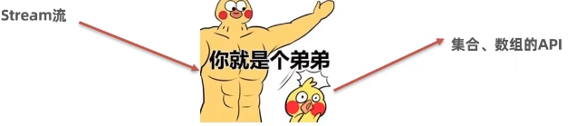
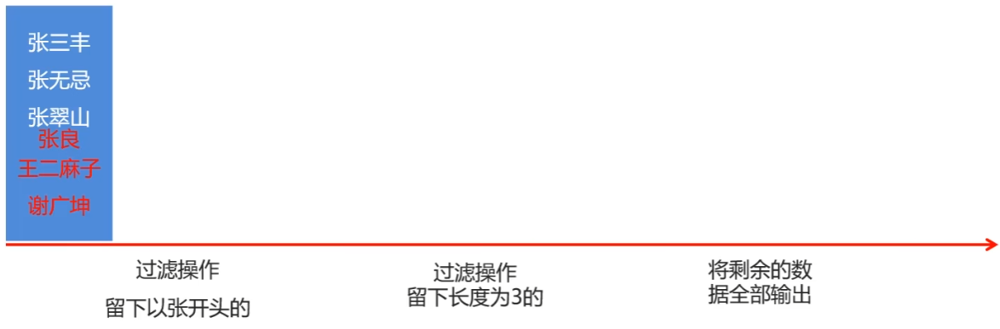
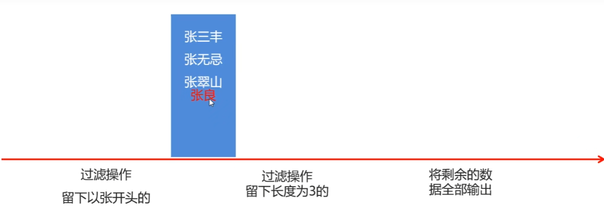
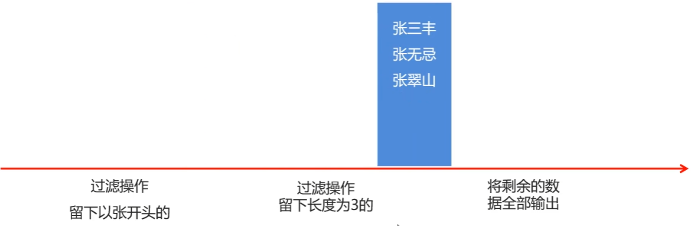
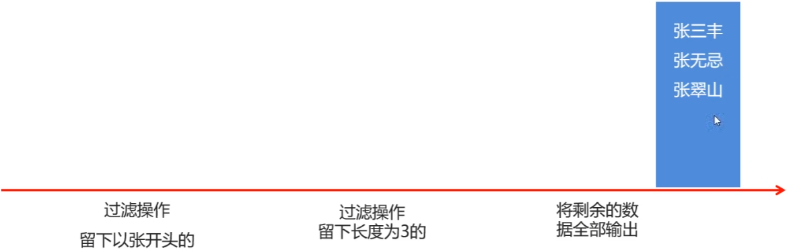

# Stream流概述

## 什么是Stream流？

- 在Java 8中，得益于Lambda所带来的函数式编程，引入了一个全新的Stream流概念。

- **目的：用于简化集合和数组操作API**

  

## 案例-体验Stream流的作用

需求：按照下面的要求完成集合的创建和遍历

- 创建一个集合，存储多个字符串元素

  ```java
  List<String> names = new ArrayList<>();
  names.add("张无忌");
  names.add("周芷若");
  names.add("赵敏");
  names.add("张强");
  names.add("张三丰");
  ```

- 把集合中所有以"张"开头的元素存储到一个新的集合

- 把"张"开头的集合中长度为3的元素存储到一个新的集合

- 遍历上一步得到的集合中的元素输出

  ```java
  names.stream().filter(d2_stream -> d2_stream.startsWith("张")).filter(d2_stream -> d2_stream.length() == 3).forEach(System.out::println);
  ```

## Steam流的思想










1. 先得到集合或者数组的Stream流（就是一根传送带）
2. 把元素放上去
3. 然后就用这个Steam流简化的API来方便的操作元素

## 总结

1. Stream流的作用是什么，集合了什么技术？
   - **简化集合、数组操作的API，集合Lambda表达式**
2. Sream流的思想和使用步骤
   - **先得到集合或者数组的Steam流（就是一根传送带）**
   - **把元素放上去**
   - **然后就用这个Steam流简化的API来方便的操作元素**

# Stream流的获取

## Steam流的三类方法

- 获取Stream流
  - 创建一条流水线，并 把数据放到流水线上准备进行操作
- 中间方法
  - 流水线上的操作。一次操作完毕之后，还可以继续进行其他操作
- 终结方法
  - 一个Steam流只能有一个终结方法，是流水线上的最后一个操作

注意：Stream操作集合的第一步是先得到Stream流，然后才能使用流的功能。

## 集合获取Stream流的方式

- 可以使用Collection接口中的默认方法生成stream()生成流

| 名称                        | 说明                       |
| --------------------------- | -------------------------- |
| default Stream <E> stream() | 获取当前集合对象的Stream流 |

## 数组获取Stream流的方式

| 名称                                          | 说明                            |
| :-------------------------------------------- | ------------------------------- |
| public static <T> Stream<T> stream(T[] array) | 获取当前数组的Stream流          |
| public static <T> Stream<T> of(T...values)    | 获取当前数组/可变数据的Stream流 |

# Steam流常用API

## Stream流的常用API(中间操作方法)

| 名称                                             | 说明                                         |
| :----------------------------------------------- | -------------------------------------------- |
| Stream<T> filter(Predicate<? super T> predicate) | 对于六种的数据进行**过滤**                   |
| Stream<T> limit(long maxSize)                    | 获取前几个元素                               |
| Stream<T> skip(long n)                           | 跳过前几个元素                               |
| Stream<T> distinct()                             | 去除流中重复元素。以来(hashCode和equals)方法 |
| static <T> Stream<T>  concat(Stream a,Stream b)  | **合并**a和b连个流为一个流                   |

**注意**

- 中间方法也并非终结 方法，调用完成后返回新的Stream流可以继续使用，支持链式编程。
- 在Stream流中无法直接修改集合、数组中的数据。

## Stream流的常用API(终结操作方法)

| 名称                           | 说明                         |
| ------------------------------ | ---------------------------- |
| void forEach(Consumer actioon) | 对此流的每个元素进行遍历操作 |
| long count()                   | 返回此流中的元素数           |

**注意：终结操作方法，调用完成后流就无法继续使用了，原因是不会返回Stream了**

## 总结

1. 终结和非终结方法的含义是什么？
   - **终结方法后流就不可以继续使用，非终结方法会返回新的流，支持链式编程。**
