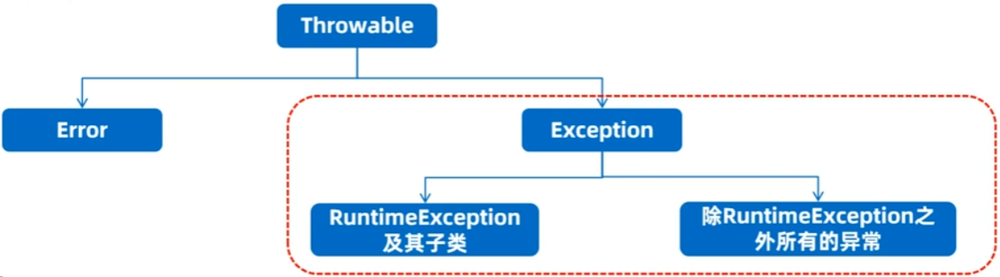
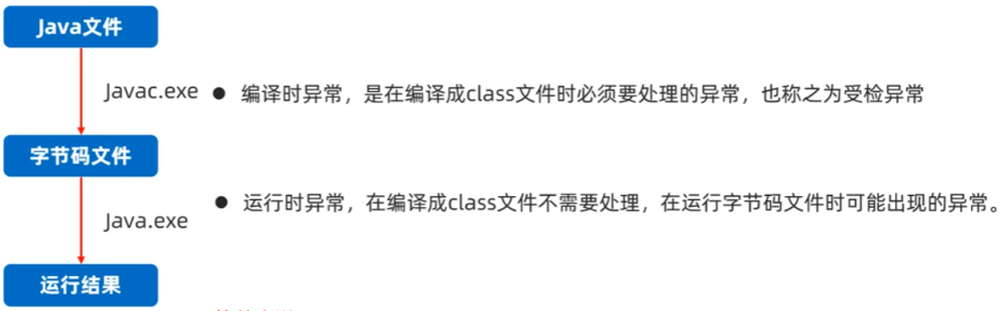

# 目录

------

[TOC]

------

# 异常概述、体系

## 什么是异常

- 异常是程序在“编译”、执行的过程中可能出现的问题，注意：语法错误不算在异常体系中。
- 比如：数组索引越界、空指针异常、日期格式化异常，等……

## 为什么要学习异常

- 异常一旦出现了，如果没有提前处理，程序就会退出JVM虚拟机而终止。
- 研究异常并且避免异常，然后提前处理异常，体现的是程序的安全、健壮性

## 异常体系



**`Error`**：

- 系统级别问题、JVM退出等，代码无法控制

**`Exception`**: `java.lang`包下，称为异常类，它表示程序本身可以处理的问题。

- **`RuntimeException`及其子类**：运行时异常，便阶段不会报错。（空指针异常，数数组索引越界异常）
- **除`RuntimeException`之外所有的异常**：编译时异常，编译器必须处理的，否则程序不能通过编译。（日期格式化异常）

## 编译时异常和运行时异常



**简单来说**

- 编译时异常就是在编译的时候出现的异常
- 运行时异常就是在运行时出现的异常

## 总结

1. 异常时什么
   - **异常是代码在百衲衣或者执行的过程中可能出现的错误**
2. 异常分为几类
   - **编译时异常、运行时异常**
   - **编译时异常：没有继承`RuntimeException`的异常，编译阶段就会出错**
   - **运行时异常：继承自`RuntimeException`的异常或其子类，编译阶段不报错，运行可能报错**
3. 学习异常的目的
   - **避免异常的出现，同时处理可能出现的异常，让代码更稳健**


# 常见运行时异常

1. 运行时异常
   - **直接继承自`RuntimeException`的异常或其子类**，编译阶段不报错，运行可能报错
2. 运行时异常示例
   - 数组索引越界异常：`ArrayIndexOutOfBoundsException`
   
     ```java
     int[] arr = {10, 20, 40};
     // 出现异常，程序退出，下一行不会执行
     System.out.println(arr[3]); 
     ```
   
     
   
   - 空指针异常：`NullPointerException`，直接输出没有问题，但是调用空指针的变量功能就会报错。
   
     ```java
     String name = null;
     // null 可以输出
     System.out.println(name);
     // 空指针异常
     System.out.println(name.length());  
     ```
   
     
   
   - 数学操作异常：`ArithmeticException`
   
     ```java
     // 报错
     int c = 10 / 0
     ```
   
     
   
   - 类型转换异常：`ClassCastException`
   
     ```java
     Object o = 23;
     // 报错
     String s = (String) o; 
     ```
   
     
   
   - 数字转换异常：`NumberFormatException`
   
     ```java
     String number = "34aa";
     // 报错
     Integer it = Integer.valueOf(number);
     ```
   
     

**运行时异常：一般时程序员业务没有考虑好或者是编程逻辑不严谨引起的程序错误**

​                                                                 ↑

​                                                           ***技术不行***

# 常见编译时异常

## 编译时异常

- 不是`RuntimeException`或者其子类的异常，编译阶段就会报错，必须处理，否则代码不通过。

## 编译时异常的作用

- 是担心程序员的技术不行，在并以阶段就报出一个错误，目的在于提醒！
- 提醒程序员这里很可能出错，请检查并注意不要出BUG.

## 编译时异常示例

```java
String date = "20222-11-20 17:37:52";
SimpleDateFormat sdf = new SimpleDateFormat("yyyy-MM-dd HH:mm:ss");
Date d = sdf.parse(date);
```

# 异常的默认处理流程

1. 默认会在出现异常的代码处自动创建一个异常对象：`ArithmeticException`。
2. 异常会从方法中出现的点这里抛出给调用者，调用者最总抛出给JVM虚拟机
3. 虚拟机接收到异常对象后，现在控制台直接输出异常栈信息数据。
4. 直接从当前执行的异常点单调当前程序。
5. 后续代码不再执行。

```java
public class ExceptionDemo {
    public static void main(String[] args) {
        System.out.println("start……");
        device(10, 2);
        device(10, 0);
        System.out.println("over!");
    }

    public static void device(int a, int b) {
        System.out.println(a);
        System.out.println(b);
        int c = a / b;
        System.out.println(c);
    }
}

/*
start……
10
2
5
10
0
Exception in thread "main" java.lang.ArithmeticException: / by zero
	at d6_exception_default.ExceptionDemo.device(ExceptionDemo.java:28)
	at d6_exception_default.ExceptionDemo.main(ExceptionDemo.java:19)
*/
```

- **默认的异常处理机制并不好，一旦真的出现异常，程序立马停止**。

# 编译时异常的处理机制

编译时异常时编译阶段就出错的，所以必须处理，否则代码根本无法通过

**编译时异常的处理形式：**

- 出现异常直接抛出去给调用者，调用者也继续抛出去
- 出现异常自己捕获处理
- 前两者结合，出现异常直接抛出去给调用者，调用者捕获处理

## **异常处理方式1——throws**

- throws:用在方法上，可以将方法内部出现的异常抛出去给本方法的调用者处理。
- **这种方式并不好，发生异常的方法自己不处理异常，如果异常最终抛出去给虚拟机将引起虚拟机死亡。**

**抛出异常格式：**

```java
方法 throws 异常1,异常2,异常3,...{
    
}
```

**规范做法：**

```java
方法 throws Exception{    
    
}
```

示例

```java
import java.io.FileInputStream;
import java.text.SimpleDateFormat;
import java.util.Date;

public class ExceptionDemo3 {
    public static void main(String[] args) throws Exception {
        System.out.println("start");
        parseTime("2022-11-20 18:11:23");
        System.out.println("over");
    }

    public static void parseTime(String timeStr) throws Exception {
        SimpleDateFormat sdf = new SimpleDateFormat("yyyy-MM-dd HH:mm:ss");
        Date date = sdf.parse(timeStr);
        System.out.println(date);
        FileInputStream file = new FileInputStream("D:/img/image.jpg");

    }
}
/*
start
Sun Nov 20 18:11:23 CST 2022
Exception in thread "main" java.io.FileNotFoundException: D:\img\image.jpg (系统找不到指定的路径。)
	at java.base/java.io.FileInputStream.open0(Native Method)
	at java.base/java.io.FileInputStream.open(FileInputStream.java:219)
	at java.base/java.io.FileInputStream.<init>(FileInputStream.java:157)
	at java.base/java.io.FileInputStream.<init>(FileInputStream.java:112)
	at d7_exception_handle.ExceptionDemo3.parseTime(ExceptionDemo3.java:29)
	at d7_exception_handle.ExceptionDemo3.main(ExceptionDemo3.java:20)
*/
```

## **异常处理方式 2—— try...catch...**

- 监视捕获异常，用在方法内部，可以将方法内部下出现的异常直接捕获处理
- **这种方式还可以，发生异常的的方法自己独立完成异常的处理，程序可以继续往下执行。**

**格式**

```java
try{
    // 监视可能出现异常的代码
}catch(异常类型1 变量){
    // 处理异常
}catch(异常类型2 变量){
    // 处理异常
}
```

**建议格式**


# 运行时异常处理机制


# 异常处理使用代码更稳健的案例


# 自定义异常


