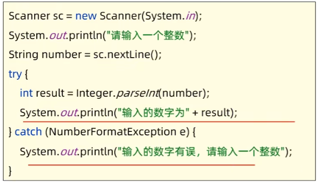
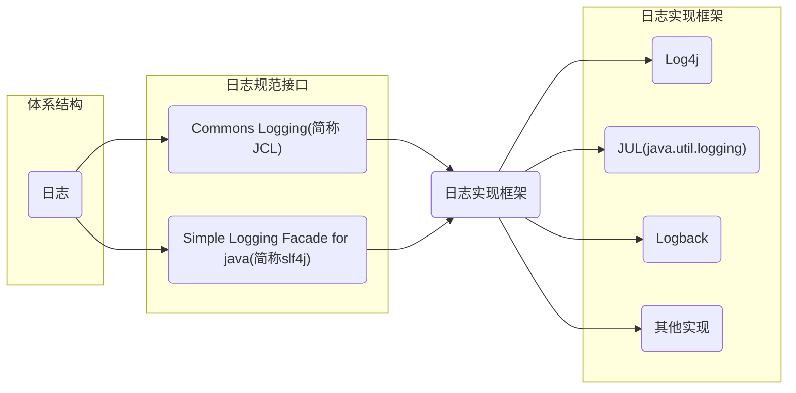
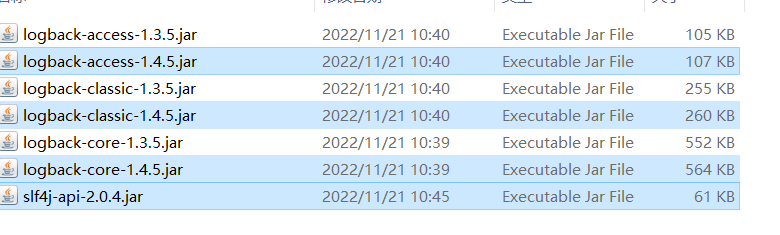

# 日志框架

[TOC]

# 日志技术的概述

## 日志

- 生活中的日志：生活中的日志好比日记，可以记录生活中的点点滴滴
- 程序中的日志：程序中的日志可以用来记录程序运行过程中的信息，并可以进行永久存储

## 以前记录日志的方式

1. 利用输出语句进行记录、查看

   

2. 输出语句的弊端:

   - 信息只能展示在控制台
   - 不能将记录到其他位置（稳健，数据库）
   - 想取消记录的信息需要修改代码才可以完成

## 日志技术

1. 优势

   - 可以将系统执行的信息选择性的记录到指定的位置（控制台、文件、数据库）
   - 可以随时开关的形式控制是否记录日志，无需修改源代码

2. 与输出语句比较

   |          |       输出语句       |       日志技术       |
   | :------: | :------------------: | :------------------: |
   | 输出位置 |        控制台        | 控制台、文件、数据库 |
   | 取消日志 | 需要修改代码，不灵活 | 不需要修改代码，灵活 |
   |  多线程  |       性能较差       |       性能较好       |

   


# 日志技术体系结构

## 体系结构



- 日志规范：一些接口，提供给日志的实现框架设计的标准
- 日志框架：第三方已经做好的日志记录实现代码，可以直接使用
- 因为对Commons Logging的接口不满意，有人就搞了SLF4J;因为对Log4j的性能不满意，有人就搞了logback

## 总结

1. 日志的规范与常见的几种形式
   - 日志规范大多是一些接口，提供非实现矿建去设计的。
   - 常见的规范
     - Commons Logging
     - Simple Logging Facade for java
2. 日志的实现框架
   1. Log4J
   2. **Logback**


# Logback概述

## Logback日志框架

- Logback是由log4j创始人设计的另一个开源日志组件，性能比log4j好。
- 官网：[Logback Home (qos.ch)](https://logback.qos.ch/index.html)
- Logback是基于slf4j的日志规范实现的框架

## Logback主要分为三个技术模块

- logback-core: logback-core木块为其他两个模块奠定了基础，必须有
- logback-classic:它是log4j的一个改良版本，同时它完整实现了slf4j API
- logback-access 模块与Tomcat 和Jetty 等Servlet容器集合，以提供HTTP访问日志功能


# Logback快速入门

## 步骤-logback快速入门

需求：导入Logback日志技术到项目中，用于记录系统的日志信息

分析：

1. 项目下新建文件夹lib,导入Logback的相关jar包到该文件夹下，并添加到项目依赖库中去。
   

2. 将Logback的核心配置稳健logback.xml直接拷贝到src目录下（必须是src下）

3. 在代码中获取日志的对象

   ```java
   import org.slf4j.Logger;
   import org.slf4j.LoggerFactory;
   
   // 创建logback日志对象
   public static final Logger LOGGER = LoggerFactory.getLogger("Test.class");
   ```

4. 使用日志对象输出日志信息

```java
import org.slf4j.Logger;
import org.slf4j.LoggerFactory;

public class Test {
    // 创建logback日志对象
    public static final Logger LOGGER = LoggerFactory.getLogger(Test.class);

    public static void main(String[] args) {
        try {
            LOGGER.debug("main开始执行");
            LOGGER.info("开始记录info日志，做除法");
            int a = 10, b = 0;
            LOGGER.trace("a=" + a);
            LOGGER.trace("b=" + b);
            System.out.println(a / b);
        } catch (Exception e) {
            e.printStackTrace();
            LOGGER.error("功能出现异常" + e);
        }
    }
}
```


# Logback配置详解-输出配置、格式设置

logback日志系统的特性都是通过配置稳健logback.xml控制的

## Logback日志输出位置、格式设置：

- 通过Logback.xml中的`<append>`标签可以设置输出位置和日志信息的详细格式。
- 通过可以设置2个日hi输出位置：一个是控制台、一个是系统文件中

## 输出到控制台的配置标志

```xml
<appender name="CONSOLE" class="ch.qos.logback.core.ConsoleAppender">
    
 </appender>
```

## 输出到文件的配置标志

```xml
<appender name="FILE" class="ch.qos.logback.core.rolling.RollingFileAppender">

</appender>
```

## 示例文件


# Logback配置详解-日志级别设置

## 日志级别

- 级别程度依次是TRACE<DEBUG<WORN<ERROR;默认级别是DEBUG（忽略大小写），对应其方法。

- 作用：用于控制系统中那些日志界别·级别是可以输出的，只输出级别不低于设定级别的日志信息。

- ALL和OFF分别是打开、关闭全部日志信息。

- 具体在root标签中设置level值进行设置，如下

  ```xml
      <root level="DEBUG">
          <appender-ref ref="Console"/>
          <appender-ref ref="FILE"/>
      </root>
  ```

- s

