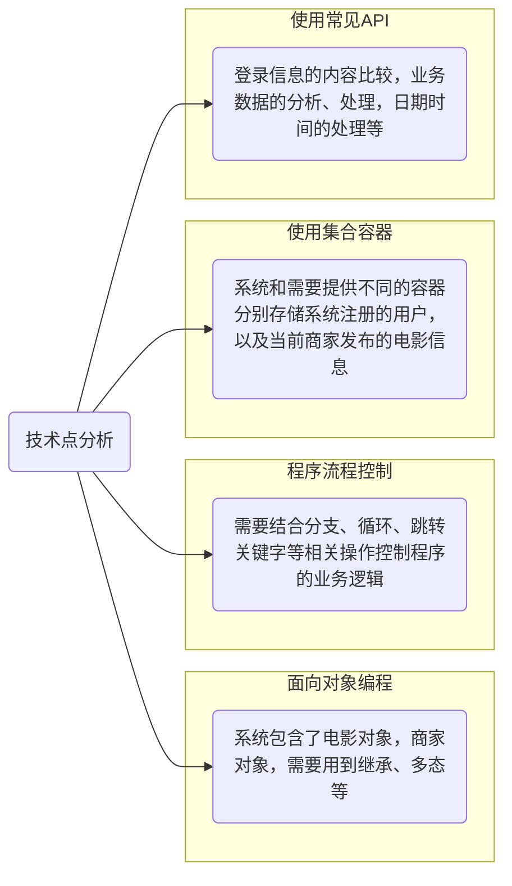

# 电影购票系统

[TOC]

# 电影购票系统简介、项目功能演示

## 技术选型分析

# 日志框架搭建、系统角色分析

## 系统和角色类

1. 集成日志框架，用于后期记录日志信息
2. 定义一个电影类`Movie`,应包含：片名、主演、评分、时长、票价、余票
3. 系统包含两种用户角色：客户与商家。存在大量相同属性信息。（分别继承）
4. 定义`User`类作为父类，属性：登录名、密码、真实姓名、性别、电话、账户余额
5. 定义`Business`类表示商家角色，属性：店铺名称，地址
6. 定义`Customer`类表示客户角色，属性 暂无
7. 定义集合`List<User>`用户存放系统注册的用户对象信息
8. 定义集合`Map<Business,List<Movie>>`存放商家和其排片信息
9. 准备测试数据。

# 首页设计、灯枯、商家界面、用户界面实现

## 界面设计

1. 首页需要包含登录，商家入驻，客户注册功能
2. 商家和客户公用一个登录功能
3. 判断登录成功的用户的真实类型，根据用户类型判断

# 商家-详情页设计、影片商家、退出

# 商家-影片下架、影片修改

## 商家功能-影片下架、修改

1. 提供影片下架功能：其实就是从商家的集合中删除影片对象
2. 影片修改功能：拿到需要修改的影片对象，修改里面的数据

# 用户-展示全部影片

# 用户-购票功能

# 用户-评分功能

# 用户-评分降序展示（作业）

# 用户-根据片名查询全部影片信息（作业）

