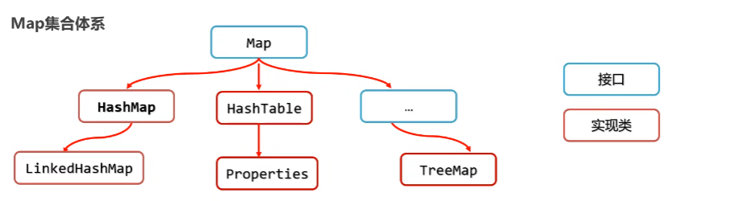

Map集合体系

1. # Map集合的概述

   1. ## Map集合概述和使用

      - Map集合是一种双列集合，每个元素包含两个数据
      - Map集合的每个元素的格式：`key = value`(键值对元素)
      - Map集合也被称为**"键值对集合"**。

   2. ## Map集合整体格式

      - `Collection`集合的格式：`[元素1, 元素2, 元素3...]`

      - Map集合的完整格式：

        ```java
        {
            key1 = value1,
            key2 = value2,
            key3 = value3,
            ...
        }
        ```

   3. ## Map集合是什么，使用场景

      - Map集合是键值对集合
      - **Map集合非常适合做类购物车这样的业务场景**

2. # Map集合体系特点

   1. ## Map集合体系
   
      
   
   2. s
   
   3. 

